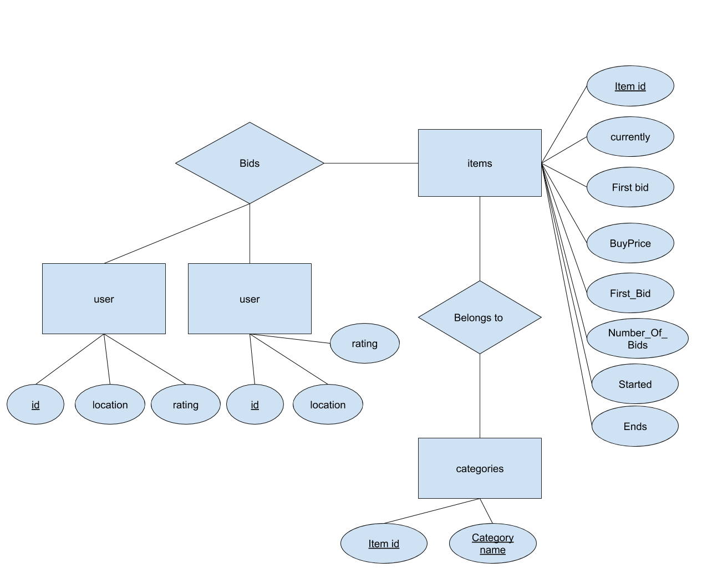

## RELATIONAL SCHEMA DESIGN
### 1. Relational definitions in text form
#### Relation Item
|  Column Name   | Type  | Key Constraint| Description
| :-: | :-: | :-:| - |
| ItemID  | INTEGER | PRIMARY KEY|An identifier unique across all items |
| Name  | TEXT | |A short item description used as the auction's title |
| Currently  | TEXT | | The current highest bid. This amount is always equal to the amount of the highest bid, or First_Bid if there are no bids.|
| BuyPrice  | TEXT | | The price, chosen by the seller before the auction starts, at which a bidder can win the auction immediately. The seller may choose not to set such a price, in which case the element would be missing.|
| FirstBid  | TEXT | | The minimum qualifying first-bid amount, as determined by the seller before the auction starts. It does not mean there is a bid at all.|
| NumberOfBids  | INTEGER | |Number of Bids/Bid elements, each corresponding to a bid for a particular item |
| Started  | TEXT | |Auction start time |
| Ends  | TEXT | | Auction end time. If this is in the past with respect to the current system time, the auction is closed. If in the future, the auction is still open.|

#### Relation User(Including bidder and seller)
|  Column Name   | Type  | Key Constraint| Description
| :-: | :-: | :-:| - |
|UserID|TEXT |PRIMARY KEY|unique id for a user across all users
|Location|TEXT||Location of User
|Country|TEXT||Country of User
|Rating|REAL||User's rating

#### Relation Category

|  Column Name   | Type  | Key Constraint| Description
| :-: | :-: | -| - |
|ItemID|INTEGER|PRIMARY KEY Together with Category   FOREIGN KEY References Item (ItemID) |An identifier unique across all items
|Category|TEXT|PRIMARY KEY Together with ItemID |A category to which the item belongs. An item may belong to multiple categories

#### Relation Bid
|  Column Name   | Type  | Key Constraint| Description
| :-: | :-: | :-:| - |
|ItemId|INTEGER|FOREIGN KEY References Item (ItemID)|An identifier unique across all items
|SellerId|TEXT|FOREIGN KEY References User (UserId)|unique id for a user across all users
|BidderId|TEXT|FOREIGN KEY References User (UserId)|unique id for a user across all users
|Time|TEXT||Time of bid
|Amount|TEXT||Amount of bid

### 2. ER diagram
